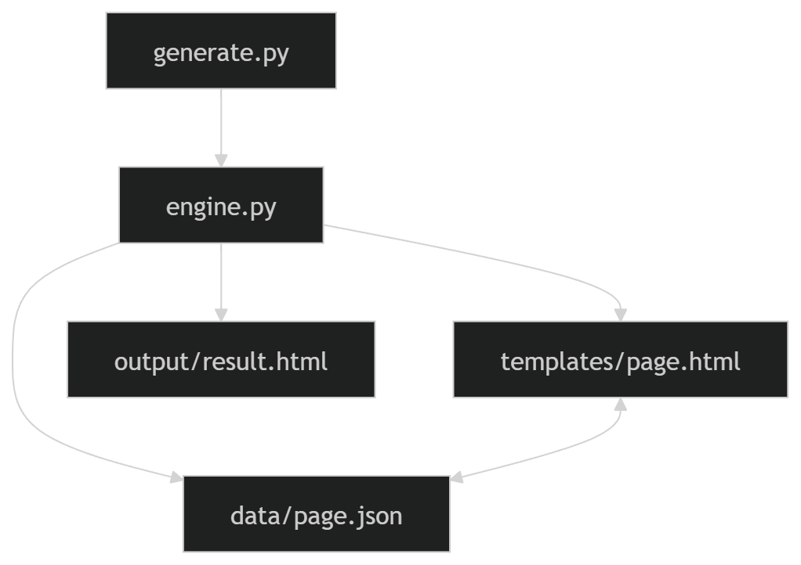

# 📘 Техническое руководство: Создание HTML Template Engine

## 1. Назначение проекта

Данный проект реализует упрощённый шаблонизатор HTML (Template Engine), который позволяет генерировать страницы на основе шаблонов и JSON-данных.

---

## 2. Архитектура системы

### 📊 UML (Component Diagram)


---

## 3. Поток данных (Data Flow Diagram)
```
[ JSON Data ]
↓
[ Template Engine ]
↓
[ HTML Template ]
↓
[ Generated HTML ]
```
---

## 4. Структура проекта

| Папка / файл        | Назначение |
|--------------------|-----------|
| src/engine.py      | Логика шаблонизатора |
| src/generate.py    | Запуск генерации |
| src/data/page.json | Входные данные |
| src/templates/     | HTML шаблоны |
| src/output/        | Результат генерации |

---

## 5. Пошаговая реализация

### Шаг 1. Создание структуры проекта
```html
src/
├── data/
├── templates/
├── output/
├── engine.py
├── generate.py
```


---

### Шаг 2. Подготовка JSON данных

```json
{
  "title": "Говори. Учись. Играй",
  "description": "Telegram-бот для изучения русского языка"
}
```

---

### Шаг 3. Создание HTML шаблона

```html
<h1>{{title}}</h1>
<p>{{description}}</p>
```

---

### Шаг 4. Реализация движка

- загрузка JSON
- чтение шаблона
- поиск {{variables}}
- замена значений

---

### Шаг 5. Генерация результата
```python
python src/engine.py
```


---

## 6. UML диаграмма классов

| TemplateEngine |
|----------------|
| + load_json()  |
| + load_template() |
| + render() |


---

## 7. UML Sequence Diagram

User → generate.py → engine.py → template → json → result.html


---

## 8. Алгоритм работы системы

### Таблица шагов

| Шаг | Описание |
|----|---------|
| 1 | Загрузка JSON |
| 2 | Загрузка шаблона |
| 3 | Поиск {{variables}} |
| 4 | Подстановка данных |
| 5 | Запись HTML |

---

## 9. Пример работы системы

### Входные данные

```json
{
  "title": "Hello",
  "description": "World"
}
```

### Шаблон

```html
<h1>{{title}}</h1>
<p>{{description}}</p>
```
### Результат

```html
<h1>Hello</h1>
<p>World</p>
```
---
## 10. Используемые технологии
| Технология | Назначение     |
| ---------- | -------------- |
| Python     | Логика движка  |
| Regex      | Поиск шаблонов |
| JSON       | Данные         |
| HTML       | Вывод          |
---
## 11. Итог

В результате создан простой, но рабочий template engine, который демонстрирует принципы:

- разделения логики и UI
- работы с шаблонами
- обработки данных
- генерации HTML